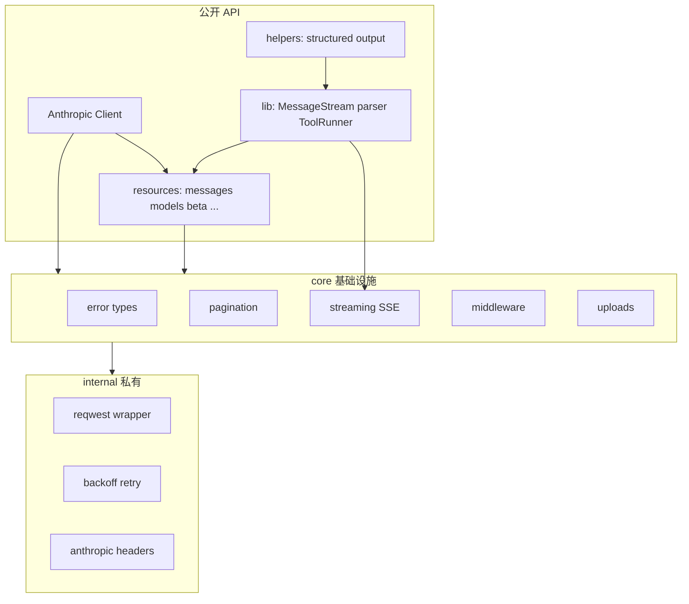
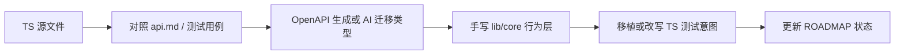

# anthropic-rust-sdk 实施计划

## 工程哲学对齐

遵循 [`.cursor/rules/engineering-principles.mdc`](../.cursor/rules/engineering-principles.mdc) 五条信条：

- **架构优先**：先定 crate 边界、模块职责、与 TS SDK 的对照关系，再写实现。
- **零技术债**：生成层与手写层边界清晰；临时方案须记录偿还计划。
- **分阶段演进**：每阶段有入口、出口、验收标准；用 ✅⚠️💤❌🚫 维护 [`docs/ROADMAP.md`](../docs/ROADMAP.md)。
- **文档同步**：代码变更同步更新架构文档与路线图。
- **计划 → 实施 → 验证**：每阶段结束须通过 `cargo fmt/clippy/test` 与文档一致性检查。

## 范围界定

### 在范围内（主线）

对标上游 **主包** [`anthropic-sdk-typescript/src/`](../anthropic-sdk-typescript/src/)：

| TS 目录 | 职责 | Rust 对应 |
|---------|------|-----------|
| `src/client.ts` | HTTP 客户端、认证、重试 | `src/client.rs` |
| `src/resources/` | OpenAPI 生成的 API 资源与类型（52 文件，116 endpoints） | `src/resources/` |
| `src/core/` | 错误、分页、上传、中间件 | `src/core/` |
| `src/internal/` | 私有工具（不对外 export） | `src/internal/`（`pub(crate)`） |
| `src/lib/` | 手写运行时（流式、解析、ToolRunner） | `src/lib/` |
| `src/helpers/` | 用户侧辅助（结构化输出等） | 视 Rust 生态以 feature 或独立模块提供 |

上游 OpenAPI 元数据：[`anthropic-sdk-typescript/.stats.yml`](../anthropic-sdk-typescript/.stats.yml)（116 endpoints，spec URL 托管于 GCS）。

### 明确不在范围内

[`anthropic-sdk-typescript/packages/`](../anthropic-sdk-typescript/packages/) 下的云厂商变体 **一律不支持**（标记 🚫）：

| 子包 | 云厂商 | 状态 |
|------|--------|------|
| `bedrock-sdk` | AWS Bedrock | 🚫 不支持 |
| `vertex-sdk` | Google Vertex AI | 🚫 不支持 |
| `aws-sdk` | AWS API Gateway | 🚫 不支持 |
| `foundry-sdk` | Azure Foundry | 🚫 不支持 |

不在 README、ROADMAP、架构文档中为其预留 crate 或 feature；若未来需求变化，须单独 ADR 再议。

### 可暂缓

- Legacy `completions` API（TS 已标记 legacy，阶段四末尾按需覆盖）
- Node 专用 `src/tools/agent-toolset/`（仅 CLI/agent 场景再 port）
- `bin/cli` 迁移工具

## 目标架构



**技术选型（阶段零确定，后续不轻易变更）：**

- 异步运行时：`tokio`
- HTTP：`reqwest`（rustls，支持 SSE）
- 序列化：`serde` + `serde_json`
- 错误：`thiserror` + 对齐 TS [`src/core/error.ts`](../anthropic-sdk-typescript/src/core/error.ts) 的错误层次
- 类型生成：以同一 OpenAPI spec 为源——优先评估 **progenitor** 或 **openapi-generator** 生成 `resources/` 骨架，再 AI 辅助对齐命名与 TS 行为；手写层集中在 `lib/` 与 `core/`

**Crate 结构（单 crate 起步，避免过早拆分）：**

```
anthropic-rust-sdk/
├── Cargo.toml
├── src/
│   ├── lib.rs              # re-exports，对标 src/index.ts
│   ├── client.rs           # 对标 src/client.ts
│   ├── core/
│   ├── internal/
│   ├── resources/
│   │   ├── messages/
│   │   ├── models.rs
│   │   ├── completions.rs
│   │   └── beta/
│   ├── lib/
│   └── helpers/            # 可选 feature
├── examples/
├── tests/                  # 集成测试 + fixture
└── docs/
    ├── ARCHITECTURE.md
    └── ROADMAP.md
```

## 分阶段路线图

### 阶段零：工程脚手架（当前 → 可 `cargo build`）

**目标**：建立可编译、可测试、可 CI 的空壳工程与文档载体。

**交付物：**
- [`Cargo.toml`](../Cargo.toml) + [`src/lib.rs`](../src/lib.rs) 模块树骨架
- 扩展 [`.gitignore`](../.gitignore)（`target/`、IDE 等）
- [`rust-toolchain.toml`](../rust-toolchain.toml) 固定 MSRV
- [`.github/workflows/ci.yml`](../.github/workflows/ci.yml)：`fmt` / `clippy` / `test`
- [`docs/ARCHITECTURE.md`](../docs/ARCHITECTURE.md)、[`docs/ROADMAP.md`](../docs/ROADMAP.md)（含云厂商 🚫 条目与阶段状态表）
- 更新 [`README.md`](../README.md)：范围说明、快速开始占位、文档链接

**验收标准：**
- `cargo build` / `cargo test` / `cargo clippy` 通过
- ROADMAP 中各阶段项均已列出初始状态（❌ 或 🚫）

---

### 阶段一：核心客户端与 HTTP 层

**对标**：[`src/client.ts`](../anthropic-sdk-typescript/src/client.ts)、[`src/core/error.ts`](../anthropic-sdk-typescript/src/core/error.ts)、[`src/internal/`](../anthropic-sdk-typescript/src/internal/)

**范围：**
- `Anthropic` / `ClientOptions`（api_key、base_url、timeout、max_retries）
- 环境变量 `ANTHROPIC_API_KEY` 读取
- 标准请求头（`anthropic-version`、`x-api-key` 等）
- 错误类型树（`APIError`、`RateLimitError`、`AuthenticationError` 等）
- 指数退避重试（对齐 TS `internal/utils/backoff`）
- `APIPromise` 等价物：Rust 中直接返回 `Result<T, Error>` 或 `impl Future`，无需额外包装类型

**验收标准：**
- 单元测试覆盖错误映射与重试逻辑
- 可用 mock HTTP server（如 `wiremock`）验证请求头与 4xx/5xx 分类

---

### 阶段二：Messages API（MVP 核心）

**对标**：[`src/resources/messages/`](../anthropic-sdk-typescript/src/resources/messages/)、[`api.md` Messages 节](../anthropic-sdk-typescript/api.md)

**范围：**
- OpenAPI 生成或手工迁移 Messages 请求/响应类型（content blocks、tools、thinking 等）
- `messages.create()` — 非流式
- `messages.count_tokens()`
- 基础示例 [`examples/messages_create.rs`](../examples/messages_create.rs)

**验收标准：**
- 集成测试可对 mock server 发起 create 请求并解析响应
- 类型结构与 TS `MessageCreateParams` / `Message` 字段对齐（允许 Rust 命名惯例 snake_case）

---

### 阶段三：流式与 MessageStream

**对标**：[`src/lib/MessageStream.ts`](../anthropic-sdk-typescript/src/lib/MessageStream.ts)、[`src/core/streaming.ts`](../anthropic-sdk-typescript/src/core/streaming.ts)

**范围：**
- `messages.create(stream: true)` 返回 SSE chunk 迭代器
- `messages.stream()` 高级封装：事件累积、`final_message()` 等价物
- Beta 流式可复用同一 SSE 基础设施（`BetaMessageStream` 推迟到阶段五）

**验收标准：**
- 测试覆盖典型 SSE fixture（可参考 TS [`tests/lib/fixtures/`](../anthropic-sdk-typescript/tests/lib/fixtures/)）
- 示例 [`examples/streaming.rs`](../examples/streaming.rs)

---

### 阶段四：Models、Batches、Completions

**对标**：[`api.md` Models/Batches 节](../anthropic-sdk-typescript/api.md)、[`src/resources/completions.ts`](../anthropic-sdk-typescript/src/resources/completions.ts)

**范围：**
- `models.list()` / `models.retrieve()`
- `messages.batches` CRUD + cancel + results
- `completions.create()`（legacy，低优先级）

**验收标准：**
- 分页游标对齐 TS `PagePromise` 行为
- batches 生命周期集成测试

---

### 阶段五：Beta API 域

**对标**：[`src/resources/beta/`](../anthropic-sdk-typescript/src/resources/beta/)（12 个子 resource，见 api.md）

**建议子阶段（降低单次 PR 体积）：**
1. `beta.messages` + `beta.models`
2. `beta.files`、`beta.skills`
3. Agents / Sessions / Environments / Deployments
4. Vaults / MemoryStores / Webhooks / UserProfiles

**验收标准：**
- 每个子 resource 至少有 create/list/retrieve 的 mock 集成测试
- `Anthropic-Beta` header 机制可用

---

### 阶段六：Helpers 与高级运行时

**对标**：[`src/helpers/`](../anthropic-sdk-typescript/src/helpers/)、[`src/lib/tools/`](../anthropic-sdk-typescript/src/lib/tools/)、[`helpers.md`](../anthropic-sdk-typescript/helpers.md)

**范围：**
- `messages.parse()` 结构化输出（serde + 可选 `schemars` 替代 zod）
- `BetaToolRunner` / `SessionToolRunner` 工具循环
- Webhook `unwrap` 验签
- Middleware 钩子

**验收标准：**
- 结构化输出 round-trip 测试
- ToolRunner 多轮对话 fixture 测试

---

## AI 辅助同步工作流

每阶段固定流程，避免盲目翻译：



**同步优先级参考**（以 [`api.md`](../anthropic-sdk-typescript/api.md) 章节为清单）：
1. Messages（含 Batches）— 最高
2. Models
3. Beta.Messages
4. 其余 Beta 子域按 ROADMAP 子阶段推进

## 验证策略

| 层级 | 手段 |
|------|------|
| 单元 | 错误映射、重试、SSE 解析、类型 serde round-trip |
| 集成 | `wiremock` / 本地 mock（可参考 TS Steady + OpenAPI spec） |
| 文档 | ROADMAP 状态与实现一致；ARCHITECTURE 模块图与目录一致 |
| CI | 每 PR 必须通过 fmt + clippy + test |

## 首步实施顺序（确认计划后执行）

1. 创建阶段零全部脚手架文件（Cargo、docs、CI、gitignore）
2. 在 `docs/ROADMAP.md` 写入完整阶段表，云厂商四项标 🚫
3. 下载/引用 OpenAPI spec，评估 progenitor 生成 PoC
4. 实现阶段一客户端骨架 + 错误类型
5. 进入阶段二 Messages MVP
