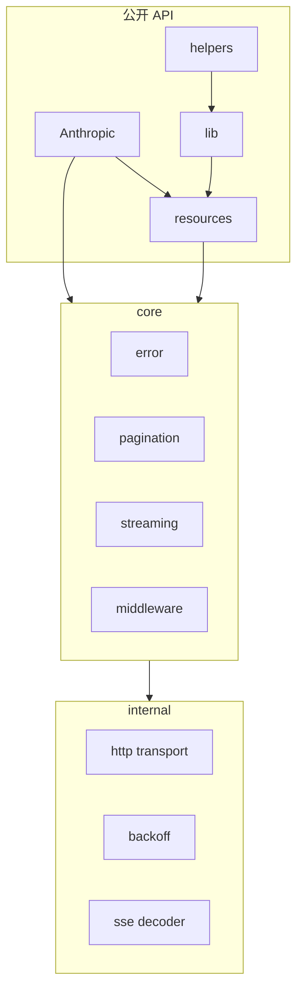

# 架构文档

## 概述

`anthropic-rust-sdk` 以官方 [anthropic-sdk-typescript](../anthropic-sdk-typescript/) 主包为上游参考，将 API 定义与运行时行为迁移为 Rust 实现。

## 模块边界

## 目录对照

| TypeScript | Rust | 可见性 |
|------------|------|--------|
| `src/client.ts` | `src/client.rs` | `pub` |
| `src/resources/` | `src/resources/` | `pub` |
| `src/core/` | `src/core/` | `pub` |
| `src/internal/` | `src/internal/` | `pub(crate)` |
| `src/lib/` | `src/runtime/` | `pub` |
| `src/helpers/` | `src/helpers/` | `pub` |

## 技术选型

| 能力 | 依赖 |
|------|------|
| 异步运行时 | `tokio` |
| HTTP | `reqwest`（rustls） |
| 序列化 | `serde` / `serde_json` |
| 错误 | `thiserror` |
| SSE 流 | `reqwest` stream + 内部 SSE 解码器 |

## 生成层与手写层

- **生成/迁移层**：`resources/` 中的请求/响应类型，对齐 OpenAPI spec（与 TS Stainless 生成层对应）。
- **手写层**：`lib/`（MessageStream、ToolRunner）、`core/middleware`、`helpers/`。

## 明确不支持

`anthropic-sdk-typescript/packages/` 下的云厂商变体不在本 crate 范围内：

| 上游子包 | 状态 |
|----------|------|
| `bedrock-sdk` | 不支持 |
| `vertex-sdk` | 不支持 |
| `aws-sdk` | 不支持 |
| `foundry-sdk` | 不支持 |

## 版本

- 上游 TypeScript SDK 参考版本：`0.110.0`（见 `anthropic-sdk-typescript/src/version.ts`）。
- 本 crate 版本：`0.110.0`（见 [`Cargo.toml`](../Cargo.toml)），与上游 TypeScript SDK 版本保持一致。

上游同步的逐项对照见 [`docs/ROADMAP.md`](ROADMAP.md) 的「上游同步」小节。
